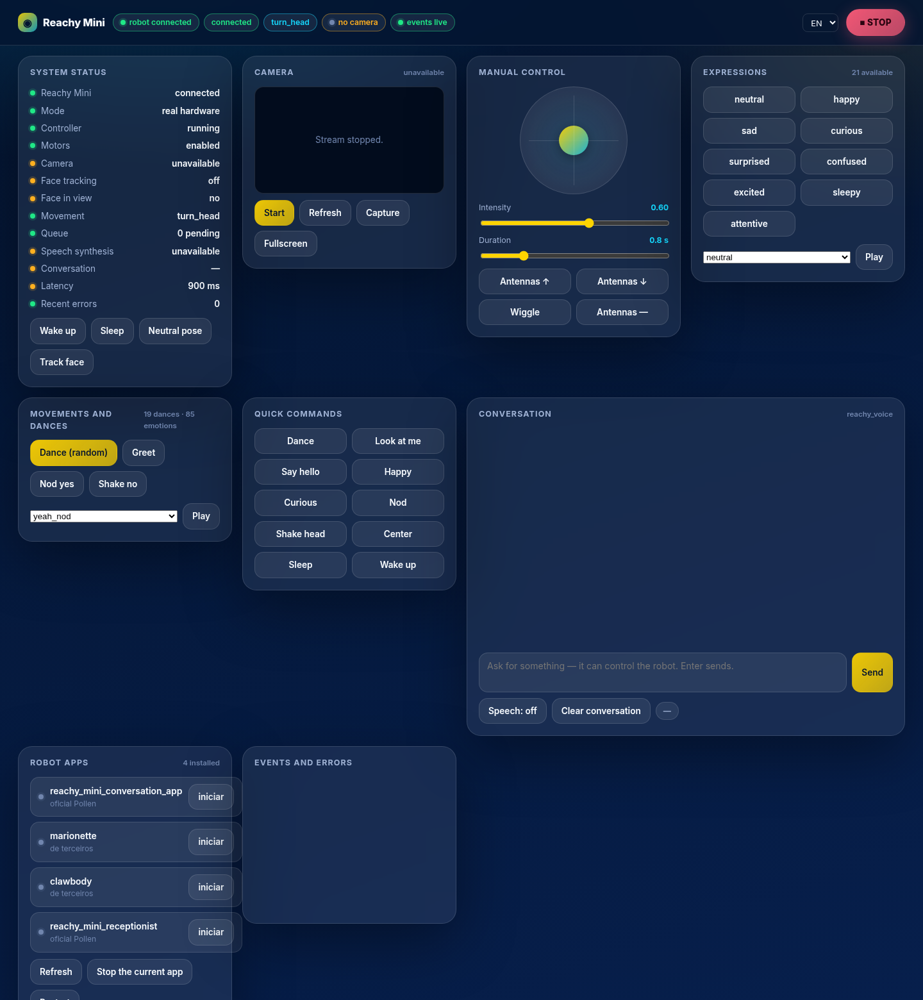
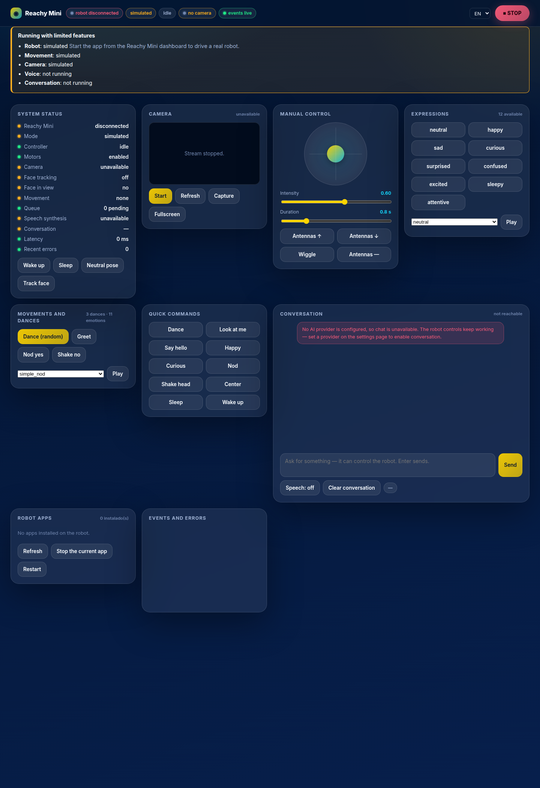

# Garra Reachy Mini

A complete control panel for Reachy Mini — head control, 85 emotions, 19 dances,
native face tracking, live camera and an emergency stop — plus an **optional** AI
layer that lets the robot listen, talk and move on its own.

**Works the moment you install it.** Everything that only needs the robot works
with no configuration at all. Conversation and voice are opt-in extras that
require services you provide; the panel tells you exactly which ones are missing
and what to do about each. Nothing is sent anywhere until you configure a
provider yourself.



With no AI provider and no voice server configured, the app still runs — it
just says so, and names what is missing:



## Features

**Available immediately, no setup**

- **Manual control** — joystick for the head, antennas, speed and intensity
  sliders, recentre
- **Expressions** — 9 canonical ones (happy, sad, curious, surprised, confused,
  excited, sleepy, attentive, neutral) resolved against the robot's own emotion
  library, plus all 85 raw moves
- **Dances** — the full 19-move library, played through the daemon so they can
  be interrupted mid-move
- **Native face tracking** — the SDK's own YuNet/ONNX tracker running inside the
  daemon. No `mediapipe`, no extra dependency, no separate venv.
- **Live camera** — MJPEG stream, snapshot, fullscreen, single frame producer
  shared by every consumer
- **Emergency stop** — a fixed button, the `Esc` key and `POST /api/robot/stop`.
  It costs exactly one round-trip to the robot daemon, which is local when the
  app runs on the robot. It holds the pose, never authenticates and never
  auto-recovers.
- **Robot apps** — list, start, stop and restart the other apps installed on your
  robot
- **REST + WebSocket API** — every panel action is a documented endpoint, and
  every state change is a real-time event

**Optional, once you configure them**

- **Conversation** — text chat from the panel, and voice if you run a speech
  server. The model can move the robot through a controlled allowlist of 20
  tools; it can never send an arbitrary pose.
- **Voice** — speech-to-text and text-to-speech through a companion server you
  run yourself (see [Voice](#voice-optional))
- **Ambient behaviour** — subtle head movement while listening, antennas while
  thinking, audio-reactive wobbling while speaking

## Requirements

| | |
|---|---|
| **Required** | A Reachy Mini (wireless or Lite) with daemon 1.9 or newer |
| **Optional — conversation** | An OpenRouter API key, or a [Garra](https://github.com/michelbr84/GarraRUST) gateway on your network |
| **Optional — voice** | A machine with a GPU running `tools/servidor_voz.py` (Whisper + Chatterbox) |

The app itself installs nothing heavy: no GPU libraries, no models, no
`mediapipe`. It runs on the robot's ARM CPU alongside the other apps.

## Install from your Reachy Mini

1. Open the Reachy Mini dashboard and go to **Applications → Discover apps**
2. Find **garra_reachy_mini** and press **Install**
3. Press **Start**

That is the whole installation. The panel comes up immediately and the robot is
controllable straight away.

### Opening the panel

The app serves its panel on port **8042**. From any machine on your network:

```
http://reachy-mini.local:8042/reachy
```

No token, no setup — see [Security](#security) for why, and for how to require
one if you want.

> The **Settings** link the dashboard shows for any app points at
> `http://0.0.0.0:8042`, which in a browser on your laptop means *your laptop*,
> not the robot. That is a platform-wide limitation — the daemon passes the URL
> through without rewriting it — so use the address above instead.

### Start and stop

**Start** launches the app and hands it exclusive ownership of the robot.
**Stop** sends `SIGINT`; the app shuts down its threads, camera and audio and
releases the robot, normally in under two seconds. The daemon then returns the
robot to its neutral pose by itself.

### Uninstall

**Applications → Installed → garra_reachy_mini → Remove.** That runs
`pip uninstall` in the shared apps venv and deletes the app's metadata.

Two things the daemon does *not* clean up, for any app:

```bash
rm -rf ~/.config/garra_reachy_mini          # settings, session state, token, captures
rm -rf ~/.cache/huggingface/hub/spaces--*   # downloaded app snapshots
```

## Configuration

Everything is optional. Set it on the settings page (`http://<robot>:8042/`), or
as an environment variable, or in `~/.config/garra_reachy_mini/.env`. The
settings page wins over the defaults; environment variables win over both.

### Conversation (optional)

| Variable | Default | Purpose |
|---|---|---|
| `OPENROUTER_API_KEY` | — | Enables conversation through OpenRouter |
| `GARRA_MODEL` | `anthropic/claude-haiku-4.5` | Model to use |
| `GARRA_GATEWAY_URL` | `http://127.0.0.1:3888` | Garra gateway, if you run one |
| `GARRA_GATEWAY_KEY` | — | Bearer token for the gateway |
| `GARRA_USUARIO` | — | Your name, so the assistant can address you |

With none of these set, the robot still listens and obeys the local shortcuts
("stop", "dance"), but says once that conversation is not configured.

### Voice (optional)

Speech needs a companion server, because speech-to-text and text-to-speech do
not fit on the robot's CPU. `tools/servidor_voz.py` in this repository runs
Whisper and Chatterbox on a GPU machine:

```bash
pip install torch torchaudio faster-whisper chatterbox-tts fastapi uvicorn
python tools/servidor_voz.py --host 0.0.0.0     # bind 0.0.0.0 so the robot reaches it
```

Then point the app at it with `GARRA_VOZ_URL=http://<your-machine>:8123`.

### Network and behaviour

| Variable | Default | Purpose |
|---|---|---|
| `GARRA_REACHY_BIND` | auto | `127.0.0.1` to keep the panel local-only |
| `GARRA_REACHY_TOKEN` | — | Require this token on the API (off by default on the robot) |
| `GARRA_REACHY_PORTA` | `8042`, else 8043–8046 | Panel port |
| `GARRA_ROBO_API` | auto-detected | Robot daemon REST URL |
| `GARRA_COMPORTAMENTO_AMBIENTE` | `true` | Ambient movement during conversation |
| `GARRA_TRACKING_AMBIENTE` | `false` | Look at the user while talking |
| `GARRA_CAMERA_FPS` | `12` | Camera capture rate |

The full list is in [`.env.example`](.env.example).

## Security

**On a wireless Reachy Mini this app is exactly as reachable as your robot
already is.** The robot's own daemon listens on all interfaces on port 8000 with
no authentication at all, so anyone on your network can already move the head
and read the camera through it. Requiring a token on our panel would not change
that, and it would make the panel unusable: the daemon has no endpoint that
shows an app's log output, so there would be nowhere to read the token from.

Two things follow, and both are deliberate:

- **On the robot**, the panel and API are open on the LAN. Set
  `GARRA_REACHY_TOKEN=<something>` to require a token anyway, or
  `GARRA_REACHY_BIND=127.0.0.1` to keep the panel strictly local.
- **Anywhere else** — a desktop driving the robot over the network, or a Lite —
  the default is loopback only, because there the daemon is loopback too and
  opening our API would create exposure that did not exist. Network access there
  needs `GARRA_REACHY_ALLOW_REMOTE=1`, and a token is generated automatically.

Always on, in every mode: `Origin` is validated on anything that changes state,
requests are rate-limited per IP, the gateway key is write-only and masked on
read, and `POST /api/robot/stop` never asks for a token — a panic button that
answers `401` is a worse hazard than the access it would deny.

If your network is not one you trust, put the robot on a segment you do. That
advice applies to the robot as a whole, not just to this app.

## Safety

**This app moves a physical robot.**

- Keep hands, hair and cables clear of the head and antennas while it runs.
- Every movement passes through a fixed envelope — ±45° yaw, ±28° pitch, ±22°
  roll, ±1.5 rad antennas, 0.15–6 s duration — enforced in `robo/limites.py`.
  Requests outside it are clamped, not rejected, and the clamp is reported in
  the response.
- The AI model cannot send arbitrary poses. It picks from an allowlist of named
  actions with validated parameters, and each one is clamped again before it
  reaches the robot.
- The emergency stop cuts the current move and **holds the pose** — it does not
  return to neutral, because returning to neutral is itself a movement.
  Recovering is two deliberate steps: clear the stop, then recentre.
- Motors are re-enabled and the robot returns to zero by the daemon when the app
  stops. Expect a short movement right after you press Stop.

## Privacy

- **Nothing leaves your network unless you configure it to.** With no API key
  and no voice server, the app makes no outbound connections beyond your robot's
  own daemon.
- **With conversation enabled**, what you type or say is sent to the provider you
  chose (OpenRouter, or your own Garra gateway) so it can reply.
- **With voice enabled**, microphone audio is sent to the speech server *you* run
  and pointed the app at.
- **Camera frames stay on the robot.** They are served on your local network for
  the panel and are never uploaded anywhere.
- **No transcripts are written to disk.** Only settings, a session id and the
  API token live in `~/.config/garra_reachy_mini/`. Photos you take with the
  capture button are saved there too, and nowhere else.
- **Credentials are never returned by the API.** `GET /api/config` masks the
  gateway key; the panel can set it but never read it back.
- **On a wireless robot the panel is reachable by anyone on your network, with
  no token** — the same posture the robot itself already has. See below.

## Architecture

```
Reachy Mini (this app is the single owner of the robot)
├── ControladorRobo ....... priority queue, preemption, e-stop, physical limits
│    └── daemon REST ...... /api/move/goto (cancellable), tracking, apps
├── FrameHub .............. one camera producer, fanned out to MJPEG/snapshot
├── FastAPI :8042 ......... /reachy panel · REST · WebSocket events
└── voice loop (optional) . VAD → speech-to-text → model → speech → speaker
```

One process owns the robot. The panel, the voice shortcuts and the AI tools all
go through the same single-threaded executor, which is what stops two commands
from fighting over the head. Movement goes through the daemon's REST API rather
than the SDK's blocking `goto_target`, because that is the only path that can be
cancelled mid-move — which is what makes the emergency stop real.

Detailed documentation, in Portuguese, is in [`DOCS_REACHY.md`](DOCS_REACHY.md):
endpoints, real-time events, the tool catalogue, how to add new movements, and
troubleshooting.

## Running from source

```bash
git clone https://github.com/GarraIA/garra-reachy-mini
cd garra-reachy-mini
pip install -e ".[dev]"

python -m garra_reachy_mini.main --simulado   # panel with no robot at all
pytest tests -q                               # 191 tests, no hardware needed
```

`--simulado` accepts every action and reports `executed: false` for all of them,
so nothing can quietly pretend a movement happened.

## Troubleshooting

| Symptom | Cause |
|---|---|
| Panel says "limited" | Normal with no AI or voice configured. The banner lists what is missing. |
| Cannot open the panel from another machine | Use `http://<robot>:8042/reachy?token=…`, not the dashboard's Settings link. Check the app log for the URL. |
| `401` on every action | The token is missing from the URL. Open the tokenized URL again. |
| Dances and expressions are empty | The move library is still loading from Hugging Face, or the daemon is unreachable. `catalog_ready` in `/api/robot/status` says which. |
| Robot deaf or mute | Another app is holding the media. Stop it from the dashboard. |
| Port is 8043 instead of 8042 | Something already holds 8042 — on a desktop, usually Pollen's `reachy-mini-control`. |
| App does not stop | It gets `SIGINT` and 20 seconds before `SIGKILL`. If it is stuck, the daemon kills the process tree. |

## Licence

[Apache-2.0](LICENSE). Built on the [Reachy Mini
SDK](https://github.com/pollen-robotics/reachy_mini) by Pollen Robotics.
